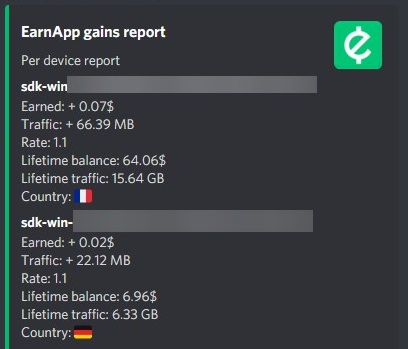
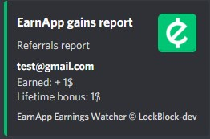
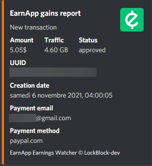

# EarnApp earnings watcher

[](https://www.npmjs.com/package/axios) [](https://www.npmjs.com/package/earnapp.js) [](https://www.npmjs.com/package/simple-discord-webhooks)

[](https://github.com/LockBlock-dev/earnapp-earnings-watcher/stargazers)

Send a report of your hourly earnings to a channel via a Discord webhook.

Bugs can occur, this is an unofficial use of the EarnApp API.

## Installation

-   Install [NodeJS](https://nodejs.org).
-   Download or clone the project.
-   Run `install.bat` OR run `npm install`.
-   In the [config.js](./index.js), you need to edit the WEBHOOK URL and the COOKIE:

```js
module.exports = {
    discordWebhookURL: "WEBHOOK URL", //Discord WebHook URL

    authMethod: "google", //don't touch this one

    oauthRefreshToken: "COOKIE", //see https://github.com/LockBlock-dev/earnapp.js#how-to-login-with-cookies

    modes: ["total", "perDevice", "referrals", "transactions"], //you can put one mode or both

    delay: 40, //delay before updating earnings
};
```

-   Run `start.bat` OR `node index.js` OR `npm start`.

## Docker

### Compose

```YAML
version: "3.3"
services:
    app:
        image: fazalfarhan01/earnapp-earning-monitor:lockblock-latest
        restart: always
        environment:
            AUTH: afbdsafdbaedgtfn
            WEBHOOK_URL: https://example.com/somthing_to_do_with_you
            MODE: all # Defaults to all when nothing specified
            # takes total / perDevice / referrals / transactions / all as option
            DELAY: 40
```

### Non-Compose

```BASH
docker run -it --rm --restart always \
-e AUTH=YOUR_AUTH_COOKIE \
-e WEBHOOK_URL=YOUR_WEBHOOK_URL_HERE \
-e MODE=YOUR_MODE_HERE \
-e DELAY=YOUR_DELAY_HERE \
fazalfarhan01/earnapp-earning-monitor:lockblock-latest
```

## How do I find my cookies ?!

Please check this [link](https://github.com/LockBlock-dev/earnapp.js/blob/master/Cookies.md#how-to-login-with-cookies).

## What is what

-   **discordWebhookURL**: the Discord Webhook URL you created
-   **authMethod**: the authentication method used to log into earnapp
-   **oauthRefreshToken**: the token used to log into earnapp
-   **modes**:
    -   total:  
        
    -   perDevice:  
        
    -   referrals:  
        
    -   transactions:  
        
-   **delay**: the delay before updating the earnings

## How does it work

The script checks every minute if it is an exact hour (17:00, 8:00, ...). Then it waits 40 seconds to allow all earnings to update. After that it gets your earnings and transactions with the provided cookie. Finally, it calculates the difference between your previous balance and the new one, calculates the difference between old and new transactions and sends the results to the Discord WebHook.

This means the webhook message will be sent at XX:00:40. Don't panic if you don't see any messages in the first few seconds.

In per-device mode, devices that have earned 0$ since the last payment are not included in the report.

## Credits

[EarnApp](https://earnapp.com)

## Copyright

See the [license](/LICENSE)
